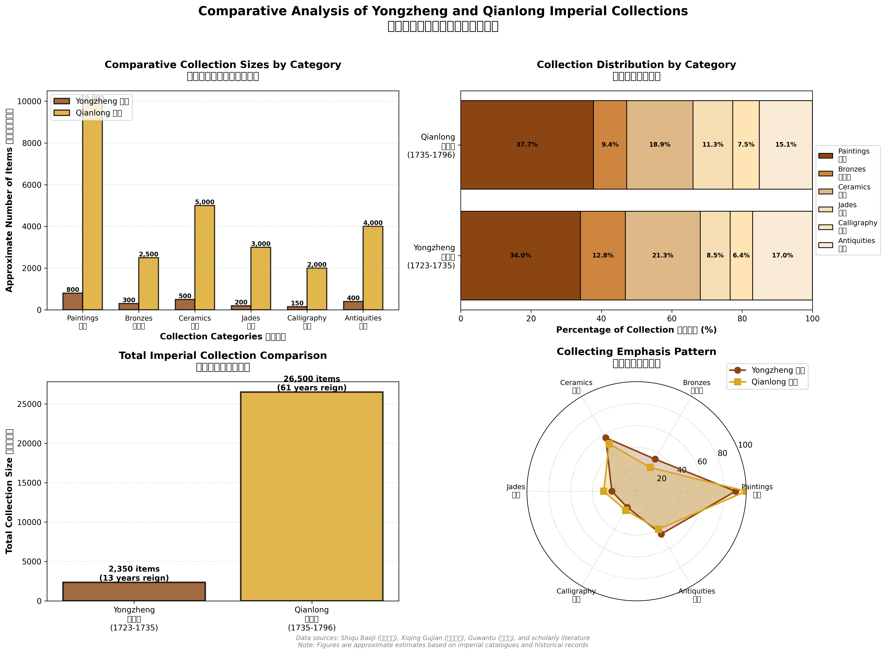
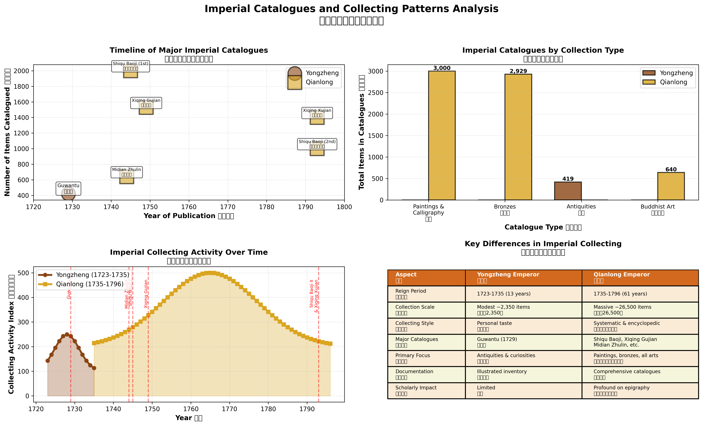

# 雍正帝与乾隆帝帝室收藏比较研究
# Comparative Study of Yongzheng and Qianlong Imperial Collections

[](https://opensource.org/licenses/MIT)
[](https://www.python.org/downloads/)
[](https://matplotlib.org/)

[English](#english) | [中文](#中文)

---

## 中文

### 📖 项目简介

本项目对清代雍正帝（1723-1735在位）与乾隆帝（1735-1796在位）的帝室收藏进行了系统的数据可视化分析和比较研究。通过对历史文献和学术研究的整理，我们创建了多维度的可视化图表，展示了两位皇帝在收藏规模、类别分布、著录方式和学术影响等方面的异同。

### 🎯 研究目标

1. **量化比较**: 通过数据可视化展示两位皇帝收藏的规模差异
2. **结构分析**: 分析收藏类别分布和收藏重点
3. **历史脉络**: 梳理宫廷著录的编纂时间线和发展历程
4. **学术影响**: 评估清宫收藏对金石学和书画鉴定学的影响

### 📊 主要发现

#### 收藏规模对比
- **雍正帝**: 约 **2,350件** 藏品（13年在位）
- **乾隆帝**: 约 **26,500件** 藏品（61年在位）
- **规模差异**: 乾隆收藏是雍正的 **11.3倍**

#### 收藏特点
| 维度 | 雍正帝 | 乾隆帝 |
|------|--------|--------|
| **收藏风格** | 个人品味导向 | 系统性百科全书式 |
| **主要关注** | 古玩珍品 | 书画、青铜器、全方位 |
| **著录方式** | 图录形式（《古玩图》） | 系统编目（《石渠宝笈》等） |
| **学术影响** | 有限 | 对金石学影响深远 |

#### 重要宫廷著录
- **雍正朝**: 《古玩图》(1729) - 419件
- **乾隆朝**: 
  - 《石渠宝笈》初编 (1745) - 约2,000件书画
  - 《西清古鉴》(1749) - 1,529件青铜器
  - 《秘殿珠林》(1744) - 640件佛教艺术
  - 《石渠宝笈》续编 (1793) - 约1,000件书画
  - 《西清续鉴》(1793) - 约1,400件青铜器

### 🖼️ 可视化图表

#### 1. 收藏规模与分布比较


包含四个子图：
- 分类收藏规模对比（柱状图）
- 收藏类别分布比例（堆叠条形图）
- 总收藏规模对比（柱状图）
- 收藏重点模式（雷达图）

#### 2. 宫廷著录与收藏模式分析


包含四个子图：
- 主要宫廷著录时间线（散点图）
- 按类型分的宫廷著录（柱状图）
- 帝室收藏活动时间分布（面积图）
- 帝室收藏主要差异对比表

### 📚 项目结构

```
qing-imperial-collections-analysis/
├── README.md                                    # 项目说明文档
├── LICENSE                                      # 开源许可证
├── requirements.txt                             # Python依赖包
├── create_qing_collections_visualization.py     # 可视化生成脚本
├── visualizations/                              # 可视化图表目录
│   ├── qing_imperial_collections_comparison.png
│   └── qing_imperial_catalogues_analysis.png
├── docs/                                        # 文档目录
│   ├── qing_imperial_collections_visualization_guide.md  # 详细分析文档
│   └── ming_qing_epigraphy_scholars_collectors.md        # 金石学家和藏家列表
└── data/                                        # 数据目录
    └── README.md                                # 数据说明
```

### 🚀 快速开始

#### 环境要求
- Python 3.8+
- matplotlib
- numpy

#### 安装依赖
```bash
pip install -r requirements.txt
```

#### 生成可视化
```bash
python create_qing_collections_visualization.py
```

生成的图表将保存在当前目录：
- `qing_imperial_collections_comparison.png`
- `qing_imperial_catalogues_analysis.png`

### 📖 详细文档

- [完整可视化分析指南](docs/qing_imperial_collections_visualization_guide.md)
- [明清金石学家和藏家列表](docs/ming_qing_epigraphy_scholars_collectors.md)

### 📊 数据来源

本项目基于以下历史文献和学术研究：

#### 一手文献
1. 《古玩图》(Guwantu, 1729) - 雍正朝宫廷收藏目录
2. 《石渠宝笈》(Shiqu Baoji, 1745 & 1793) - 乾隆朝书画收藏目录
3. 《西清古鉴》(Xiqing Gujian, 1749) - 乾隆朝青铜器收藏目录
4. 《秘殿珠林》(Midian Zhulin, 1744) - 乾隆朝佛教艺术收藏目录
5. 《西清续鉴》(Xiqing Xujian, 1793) - 乾隆朝青铜器续编目录

#### 学术文献
- Grimberg, P. (2024). "Guwantu: The Yongzheng Emperor's 'Illustrated Inventory of Ancient Playthings'." *Transactions of the Royal Historical Society*.
- Lefebvre, É. (2008). "L'Image des antiquités accumulées de Ruan Yuan." *Arts Asiatiques*.
- 以及其他115篇相关学术论文

### 🎓 学术价值

#### 研究贡献
1. **数据可视化**: 首次系统地将清宫收藏数据进行可视化呈现
2. **比较研究**: 提供了雍正与乾隆收藏的多维度比较框架
3. **历史分析**: 揭示了清代宫廷收藏的发展脉络和学术影响

#### 应用场景
- 艺术史教学和研究
- 博物馆展览策划
- 文物鉴定参考
- 清史研究
- 金石学史研究

### 🤝 贡献指南

欢迎对本项目进行改进和扩展！

#### 如何贡献
1. Fork 本仓库
2. 创建您的特性分支 (`git checkout -b feature/AmazingFeature`)
3. 提交您的更改 (`git commit -m 'Add some AmazingFeature'`)
4. 推送到分支 (`git push origin feature/AmazingFeature`)
5. 开启一个 Pull Request

#### 改进方向
- 添加更多历史数据和藏品信息
- 创建交互式可视化（如使用 Plotly、D3.js）
- 扩展到其他清代皇帝的收藏研究
- 添加私人藏家的比较分析
- 多语言支持（英文、日文等）

### 📄 许可证

本项目采用 MIT 许可证 - 详见 [LICENSE](LICENSE) 文件

### 📮 联系方式

如有问题或建议，欢迎：
- 提交 Issue
- 发起 Discussion
- 通过 Pull Request 贡献代码

### 🙏 致谢

感谢所有为清代宫廷收藏研究做出贡献的学者和研究者。

---

## English

### 📖 Project Overview

This project presents a systematic data visualization and comparative analysis of the imperial collections of Emperor Yongzheng (r. 1723-1735) and Emperor Qianlong (r. 1735-1796) of the Qing Dynasty. Through comprehensive review of historical documents and scholarly research, we have created multi-dimensional visualizations that illustrate the similarities and differences between these two emperors in terms of collection scale, category distribution, cataloging methods, and scholarly impact.

### 🎯 Research Objectives

1. **Quantitative Comparison**: Visualize the scale differences between the two emperors' collections
2. **Structural Analysis**: Analyze the distribution of collection categories and collecting priorities
3. **Historical Context**: Map the timeline and development of imperial catalogues
4. **Scholarly Impact**: Assess the influence of Qing imperial collections on epigraphy and painting connoisseurship

### 📊 Key Findings

#### Collection Scale Comparison
- **Emperor Yongzheng**: Approximately **2,350 items** (13-year reign)
- **Emperor Qianlong**: Approximately **26,500 items** (61-year reign)
- **Scale Difference**: Qianlong's collection was **11.3 times** larger than Yongzheng's

#### Collection Characteristics
| Dimension | Yongzheng | Qianlong |
|-----------|-----------|----------|
| **Collecting Style** | Personal taste-oriented | Systematic & encyclopedic |
| **Primary Focus** | Antiquities & curiosities | Paintings, bronzes, comprehensive |
| **Cataloging Method** | Illustrated inventory (Guwantu) | Comprehensive catalogues |
| **Scholarly Impact** | Limited | Profound influence on epigraphy |

#### Major Imperial Catalogues
- **Yongzheng Reign**: *Guwantu* (1729) - 419 items
- **Qianlong Reign**:
  - *Shiqu Baoji* 1st ed. (1745) - ~2,000 paintings & calligraphy
  - *Xiqing Gujian* (1749) - 1,529 bronzes
  - *Midian Zhulin* (1744) - 640 Buddhist art pieces
  - *Shiqu Baoji* 2nd ed. (1793) - ~1,000 paintings & calligraphy
  - *Xiqing Xujian* (1793) - ~1,400 bronzes

### 🖼️ Visualizations

#### 1. Collection Size and Distribution Comparison


Contains four sub-charts:
- Comparative collection sizes by category (bar chart)
- Collection distribution by category (stacked bar chart)
- Total collection comparison (bar chart)
- Collecting emphasis pattern (radar chart)

#### 2. Imperial Catalogues and Collecting Patterns Analysis


Contains four sub-charts:
- Timeline of major imperial catalogues (scatter plot)
- Imperial catalogues by collection type (bar chart)
- Imperial collecting activity over time (area chart)
- Key differences comparison table

### 📚 Project Structure

```
qing-imperial-collections-analysis/
├── README.md                                    # Project documentation
├── LICENSE                                      # Open source license
├── requirements.txt                             # Python dependencies
├── create_qing_collections_visualization.py     # Visualization script
├── visualizations/                              # Visualization charts
│   ├── qing_imperial_collections_comparison.png
│   └── qing_imperial_catalogues_analysis.png
├── docs/                                        # Documentation
│   ├── qing_imperial_collections_visualization_guide.md
│   └── ming_qing_epigraphy_scholars_collectors.md
└── data/                                        # Data directory
    └── README.md
```

### 🚀 Quick Start

#### Requirements
- Python 3.8+
- matplotlib
- numpy

#### Install Dependencies
```bash
pip install -r requirements.txt
```

#### Generate Visualizations
```bash
python create_qing_collections_visualization.py
```

The generated charts will be saved in the current directory:
- `qing_imperial_collections_comparison.png`
- `qing_imperial_catalogues_analysis.png`

### 📖 Documentation

- [Complete Visualization Analysis Guide](docs/qing_imperial_collections_visualization_guide.md)
- [List of Ming-Qing Epigraphy Scholars and Collectors](docs/ming_qing_epigraphy_scholars_collectors.md)

### 📊 Data Sources

This project is based on the following historical documents and scholarly research:

#### Primary Sources
1. *Guwantu* (1729) - Yongzheng imperial collection catalogue
2. *Shiqu Baoji* (1745 & 1793) - Qianlong painting & calligraphy catalogue
3. *Xiqing Gujian* (1749) - Qianlong bronze catalogue
4. *Midian Zhulin* (1744) - Qianlong Buddhist art catalogue
5. *Xiqing Xujian* (1793) - Qianlong bronze supplement catalogue

#### Scholarly Literature
- Grimberg, P. (2024). "Guwantu: The Yongzheng Emperor's 'Illustrated Inventory of Ancient Playthings'." *Transactions of the Royal Historical Society*.
- Lefebvre, É. (2008). "L'Image des antiquités accumulées de Ruan Yuan." *Arts Asiatiques*.
- Plus 115 additional scholarly papers

### 🎓 Academic Value

#### Research Contributions
1. **Data Visualization**: First systematic visualization of Qing imperial collection data
2. **Comparative Study**: Provides multi-dimensional comparison framework
3. **Historical Analysis**: Reveals the development trajectory and scholarly impact

#### Application Scenarios
- Art history teaching and research
- Museum exhibition planning
- Cultural relic authentication reference
- Qing Dynasty historical studies
- History of epigraphy studies

### 🤝 Contributing

Contributions to improve and expand this project are welcome!

#### How to Contribute
1. Fork the repository
2. Create your feature branch (`git checkout -b feature/AmazingFeature`)
3. Commit your changes (`git commit -m 'Add some AmazingFeature'`)
4. Push to the branch (`git push origin feature/AmazingFeature`)
5. Open a Pull Request

#### Improvement Directions
- Add more historical data and artifact information
- Create interactive visualizations (e.g., using Plotly, D3.js)
- Extend to other Qing emperors' collections
- Add comparative analysis with private collectors
- Multi-language support (Japanese, French, etc.)

### 📄 License

This project is licensed under the MIT License - see the [LICENSE](LICENSE) file for details

### 📮 Contact

For questions or suggestions:
- Submit an Issue
- Start a Discussion
- Contribute via Pull Request

### 🙏 Acknowledgments

Thanks to all scholars and researchers who have contributed to the study of Qing imperial collections.

---

**Citation**: If you use this project in your research, please cite:
```bibtex
@software{qing_imperial_collections_2025,
  title = {Comparative Study of Yongzheng and Qianlong Imperial Collections},
  author = {SciSpace Research Team},
  year = {2025},
  url = {https://github.com/[your-username]/qing-imperial-collections-analysis}
}
```

---

**Last Updated**: December 30, 2025  
**Version**: 1.0.0
